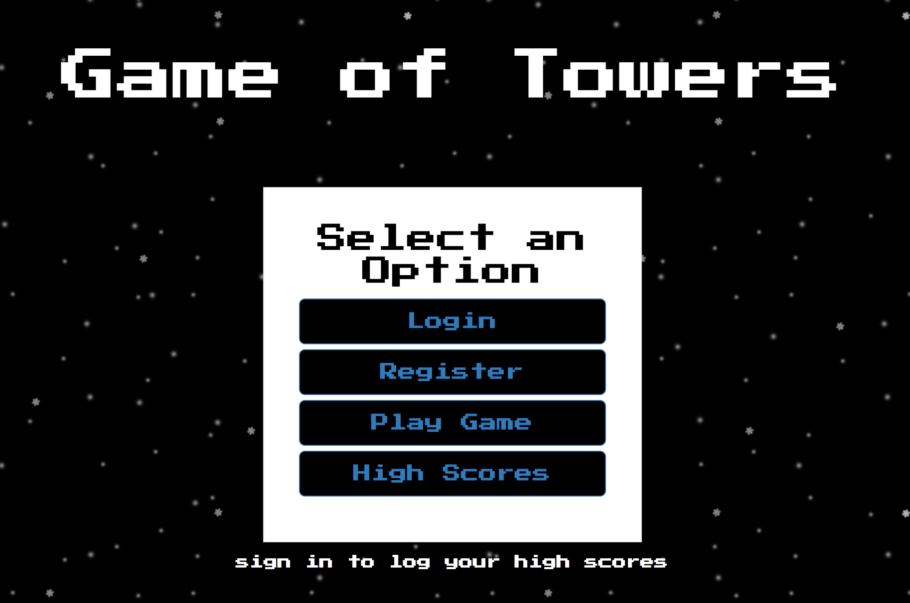
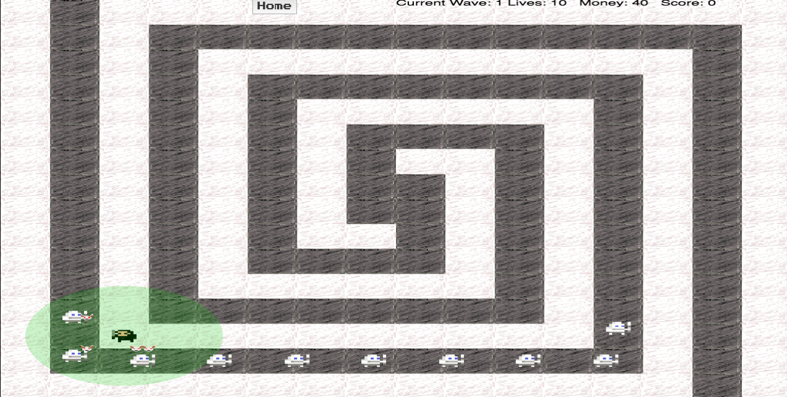
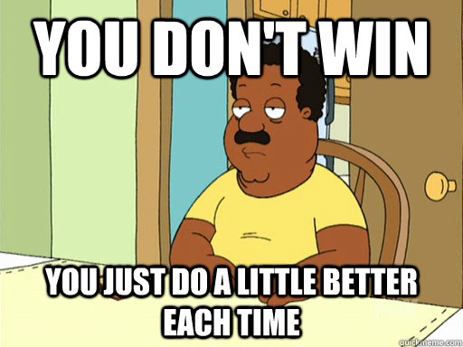

# Game of Towers

A tower defense game inspired by Game of Thrones. Created by Mat, JR, Beatrix, and Raburn.

### Demo: https://gameoftowers.herokuapp.com/

## About Game of Towers

Who doesn't love video games? Who doesn't love a good tower defense game? We're all nerds here, of course we love video games! Game of Towers was developed for nerds by nerds. We wanted everyone to experience the excitement of playing a simple yet fun video game.

## Getting set up

* You do NOT have to register an account to play Game of Towers. The only downside is that your score will not be posted to the high scores list.
* If you just want to play the game, simply press the `Play Game` button. At the top, press `Start Game`. Not too hard, now is it?
* If you wish to register an account
	* Press the `Register` button and input a username and password you will remember
	* Once successfully registered, you will be prompted back to the home page
	* Press the `Login` button to log in to Game of Towers and track your high scores

## How to ACTUALLY play

* Once the game is rolling, enemies will spawn at the top left corner of the map and move their way around the path and exit through the bottom right section of the map. If an enemy reaches the end of their path, you will lose 1 life. The player has a total of 10 lives.
* Your goal is to attack these enemies by placing towers on the map. You may place a tower by left clicking on any white tile. Each tower cost 60 gold. Each enemy killed earns the player 3 gold.
* Once you complete a round, a sound of joy will play through your speakers and the next round will begin. There are an infinite number or rounds.
* If you run out of lives, a very large L will fill the screen and you will probably be sad. If you earned a high score, it will automatically be posted to the high scores list.

## API Documentation

* /users
	* GET: retrieve all the registered users from the database
	* POST: register a new user securely to the database
* /users/`username`
	* GET: retrieve a specific user searching by the username
* /scores
	* GET: retrieve all the scores from the database
	* POST: submit a new high score to the database

## Technical

We used React and Redux to build the frontend portion of the website. Async actions are dispatched to gather and send data from the database. The backend is built using Node.js and the database is configured using MongoDB. Our custom game engine was developed using vanilla JavaScript as we followed the architectural pattern known as the Entity Component System. Images are drawn on the screen compliments of the canvas library. Enemies follow the A* algorithm to move around the map and stay on their designated path. Registered accounts are secured due to the hashing process from the bcrypt library.

# GLHF